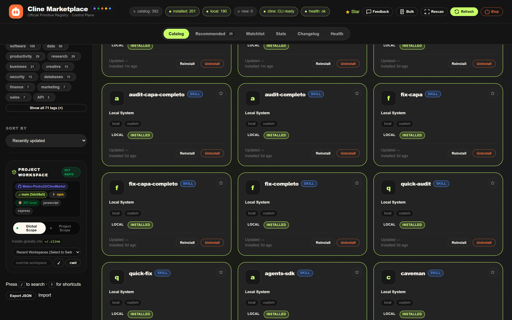
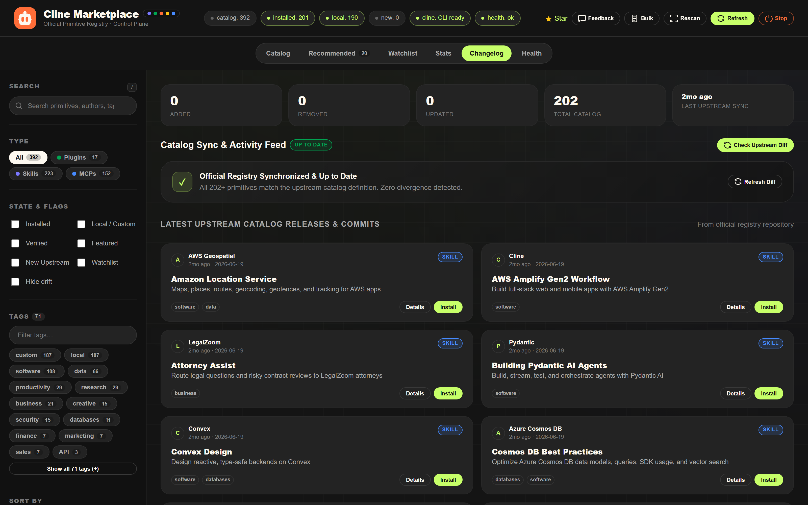
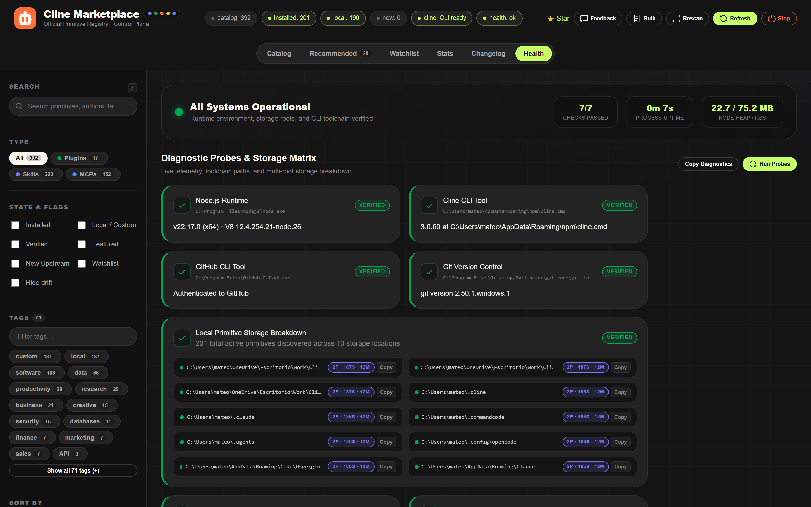
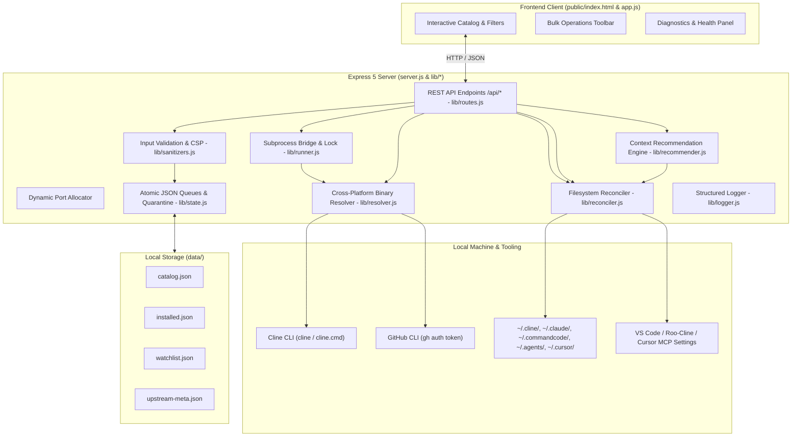

<div align="center">


# Cline Marketplace — Local Browser & Control Plane

A developer-grade, offline-first local web application and CLI to browse, install, verify, and manage every primitive (**plugins**, **skills**, and **MCP servers**) published in the official [Cline Marketplace](https://github.com/cline/marketplace).

[](https://nodejs.org)
[](https://expressjs.com)
[](https://developer.mozilla.org/en-US/docs/Web/JavaScript)
[](https://docs.cline.bot)
[](https://github.com/Mateo-Piedra22/ClineMarket/actions)
[](LICENSE)
[](#security-and-guard-rails)

</div>

---

## Table of Contents

- [Overview](#overview)
- [Visual Interface and Screenshots](#visual-interface-and-screenshots)
- [System Architecture](#system-architecture)
- [Core Features](#core-features)
- [Quick Start](#quick-start)
- [Command Line Interface](#command-line-interface)
- [Repository and CI/CD Automations](#repository-and-cicd-automations)
- [REST API Reference](#rest-api-reference)
- [Workspace Context and Heuristics](#workspace-context-and-heuristics)
- [Security Audit and Threat Model](#security-audit-and-threat-model)
- [Configuration Reference](#configuration-reference)
- [Troubleshooting Matrix](#troubleshooting-matrix)
- [Contributing and Development](#contributing-and-development)
- [License](#license)

---

## Overview

The official [Cline Marketplace](https://cline.github.io/marketplace) provides a global registry of extensions, operating as a static JSON catalog. 

**Cline Marketplace Local Browser** transforms that catalog into a **bidirectional, local control plane**:

1. **Mirroring and Local Cache**: Ingests and persists the upstream catalog in `catalog.json` alongside upstream commit metadata in `data/upstream-meta.json`.
2. **Filesystem Discovery**: Scans local directories (`~/.cline/plugins/`, `~/.cline/skills/`) and VS Code / Roo-Cline / Claude configuration files (`cline_mcp_settings.json`, Claude Desktop configurations) to detect installed primitives.
3. **Automated CLI Bridge**: Dispatches `cline plugin install`, `cline skill install`, and `cline mcp install` directly from interactive cards, with automatic `--force` retry handling when upgrading existing installations.
4. **Offline First**: All search indexing, tag filtering, installed reconciliations, and watchlist management execute locally on your machine with zero external network dependencies beyond catalog refreshes.

---

## Visual Interface and Screenshots

### Catalog Browser View

Full catalog interface showing 200+ primitives, multi-token search, type chips, state flags, and real-time status strip adhering strictly to the Navigate design specification (`DESIGN.md`).


### Recommended Workspace Toolchains

Auto-detects project tech stack, Git remotes, and dependency trees to rank primitives and assemble curated toolchain bundles from the recommendation engine (`lib/recommender.js`).


### Primitive Detail and Execution Modal

Deep view of any primitive showing official install commands, environment variable schemas, and action triggers.


### Project Workspace Control & Stack Engine

Dynamic workspace supervisor showing active Git repository, branch with short commit hash, active package manager, workspace-local primitive counts, global vs project scope toggle, and live directory path validation.



### Upstream Changelog & Activity Feed

Real-time upstream synchronization feed featuring top KPI metric cards (Added, Removed, Updated, Catalog Version, Last Sync), interactive visual diff inspection, and upstream release timeline with direct installation triggers.



### System Statistics

Breakdown by primitive type, top author distributions, commit freshness histograms, and local installation coverage.


### System & CLI Health Diagnostics

Comprehensive runtime probes with top KPI operational banner, live Node Heap & RSS RAM gauge, process uptime counter, toolchain executable paths, and multi-root storage breakdown with individual copy actions.



---

## System Architecture



---

## Core Features

| Area | Functionality |
| :--- | :--- |
| **Catalog Browser** | Real-time search across 250+ primitives with multi-token filtering by keyword, author, license, tags, and state flags. |
| **Bulk Mode** | Multi-select primitives across search results to batch-install, batch-uninstall, watch, or unwatch in a single atomic queue. |
| **Curated Toolchains** | Workspace toolchains assembled data-driven from the recommendation engine (Node & TypeScript Fullstack, Python AI/ML, Cloudflare & Edge, Databases, Testing/QA, API Development, Agentic AI, and more), installable with one click. |
| **Workspace Matcher** | Deep heuristic analysis of `package.json`, `pyproject.toml`, `Cargo.toml`, `go.mod`, Git remotes, and project files to score catalog entries. The rewritten `lib/recommender.js` engine adds dependency-name, workspace-hint, and id-match signals and excludes already-installed primitives. |
| **Live Drift Detection** | Filesystem reconciler automatically discovers externally installed primitives and surfaces `drift` flags if an item was removed. |
| **Dynamic Port Binding** | Automatically detects port conflicts on `5173` and binds to the next available socket (`5174`, `5175`, ...) without crashing. |
| **Process Management** | Dedicated server shutdown endpoint (`POST /api/shutdown`) and Windows process tree kill (`taskkill /pid /T /F`) for timeouts. |
| **Structured Terminal Logging** | Timestamped console logs with latency measurements, HTTP status indicators, `NO_COLOR` support, and execution traces. |
| **Data Portability** | JSON export and import of installed primitive states with schema validation, sanitizers, and overwrite protections. |

---

## Quick Start

### One-Shot Zero Configuration (NPX)

Run the marketplace instantly with zero local installation:

```bash
npx cline-marketplace
```

The runner automatically checks runtime dependencies, fetches the catalog if missing, binds to a free port, and opens your default browser.

### Running Locally from Source

```bash
# Clone the repository
git clone https://github.com/Mateo-Piedra22/ClineMarket.git
cd ClineMarket

# Install dependencies (Express 5.x)
npm install

# Download the latest catalog and commit metadata
npm run refresh

# Start the server (binds to http://127.0.0.1:5173 or next free port)
npm start
```

### Global CLI Installation

```bash
# Link globally to your system PATH
npm link

# Launch the marketplace from any workspace directory
cline-marketplace
```

---

## Command Line Interface

The `cline-marketplace` executable provides direct control over the local control plane:

```bash
# Start server and automatically launch the default browser
cline-marketplace

# Start server in headless mode without opening a browser window
cline-marketplace --no-open

# Specify custom port override
cline-marketplace --port 5200

# Inspect local server status, catalog counts, and active storage roots
cline-marketplace status

# Run system environment, CLI toolchain, and storage diagnostics
cline-marketplace health

# List all discovered and installed primitives
cline-marketplace list

# Full catalog synchronization with GitHub commit timestamps
cline-marketplace refresh

# Fast catalog synchronization (skips commit metadata pass)
cline-marketplace refresh --catalog

# Check for updates and pull latest changes from upstream
cline-marketplace update

# Display interactive reference manual
cline-marketplace --help
```

---

## Repository and CI/CD Automations

| Workflow | Path | Trigger | Purpose |
| :--- | :--- | :--- | :--- |
| **CI & Quality Gate** | `.github/workflows/ci.yml` | Push & PR to `main` | Matrix tests across Node.js 18.x, 20.x, 22.x, 24.x on Ubuntu, Windows, and macOS. |
| **Upstream Sync Cron** | `.github/workflows/sync-catalog.yml` | Every 6 hours / Manual | Automatically downloads upstream `cline/marketplace` catalog, detects new primitives, and commits updates with `[skip ci]`. |
| **Release Automation** | `.github/workflows/release.yml` | Tag push `v*.*.*` / Manual | Auto-generates GitHub Releases, changelogs, test gating, and release assets. |
| **Auto-Changelog** | `.github/workflows/auto-changelog.yml` | Push & PR to `main` | Generates continuous Release Drafter notes categorized by change type. |
| **CodeQL Security** | `.github/workflows/codeql.yml` | Push, PR & Weekly Cron | Static Application Security Testing (SAST) for JavaScript code vulnerabilities. |
| **Dependabot** | `.github/dependabot.yml` | Weekly | Monitors and creates PRs for outdated npm packages and GitHub Actions. |

---

## REST API Reference

The server exposes a REST API on `http://127.0.0.1:5173`:

| Method | Endpoint | Description | Parameters / Payload |
| :--- | :--- | :--- | :--- |
| `GET` | `/api/catalog` | Returns the enriched catalog with local state, commit dates, and local custom entries. | `?cwd=/path/to/project` |
| `GET` | `/api/installed` | Executes a filesystem probe across `~/.cline` and VS Code configs, returning reconciled state. | `?cwd=/path/to/project` |
| `GET` | `/api/status` | Returns runtime health, Node version, memory usage, uptime, detected `cline` path, and storage roots. | None |
| `GET` | `/api/version` | Returns current package version and app metadata. | None |
| `GET` | `/api/context` | Runs stack heuristics against a workspace directory, scoring catalog entries with the recommender engine and returning ranked data-driven bundle recommendations with completion percentages. | `?cwd=/path/to/project` |
| `POST` | `/api/workspaces/validate` | Validates directory existence, `.git` repository, package manager lockfiles, and `.cline` configurations. | `{"path": "/path/to/project"}` |
| `POST` | `/api/install` | Invokes `cline <type> install <args>` with automatic `--force` retry on existing packages. | `{"type": "plugin", "id": "goal", "scope": "global"}` |
| `POST` | `/api/uninstall` | Invokes `cline <type> uninstall <id>` and updates local registry records. | `{"type": "plugin", "id": "goal"}` |
| `POST` | `/api/bulk` | Executes batch `install`, `uninstall`, `watch`, or `unwatch` across up to 30 items. | `{"action": "install", "items": [{"type": "plugin", "id": "goal"}]}` |
| `GET` | `/api/watchlist` | Lists all starred primitives with timestamps. | None |
| `POST` | `/api/watchlist` | Adds a primitive to the local watchlist. | `{"type": "skill", "id": "code-review"}` |
| `POST` | `/api/watchlist/toggle` | Toggles star state of a primitive. | `{"type": "plugin", "id": "goal"}` |
| `DELETE` | `/api/watchlist/:type/:id` | Removes a primitive from the watchlist. | None |
| `POST` | `/api/mark` | Manually registers a primitive as installed without invoking the CLI. | `{"type": "plugin", "id": "my-custom-plugin"}` |
| `DELETE` | `/api/mark/:type/:id` | Removes a primitive from manual records. | None |
| `DELETE` | `/api/forget/:type/:id` | Forgets an entry from local storage. | None |
| `GET` | `/api/stats` | Aggregates category counts, top authors, freshness histograms, and coverage metrics. | None |
| `GET` | `/api/changelog` | Returns diff against previous catalog and synthesized upstream release timeline stream. | None |
| `GET` | `/api/health` | Executes async diagnostic probes (`node`, `cline`, `gh`, `git`, `storage`, `catalog`, `metadata`). | None |
| `GET` | `/api/logs` | Returns recent server execution logs for diagnostics and debugging. | `?limit=100` |
| `GET` | `/api/export` | Generates a downloadable JSON backup of all installed primitives. | None |
| `POST` | `/api/import` | Restores installed primitives from a JSON backup with type/id sanitization. | `{"installed": [...]}` |
| `POST` | `/api/refresh` | Triggers background upstream catalog synchronization in-process. | None |
| `POST` | `/api/settings` | Updates client configuration with key whitelisting. | `{"defaultScope": "workspace"}` |
| `POST` | `/api/workspaces/recent` | Saves workspace to recent MRU list. | `{"path": "/path/to/project"}` |
| `POST` | `/api/shutdown` | Gracefully terminates the background Node.js process. | None |

---

## Workspace Context and Heuristics

When navigating to the **Recommended** tab, `lib/routes.js` and `scripts/detect-context.mjs` analyze the specified workspace directory and extract stack metadata:

```jsonc
{
  "cwd": "C:/Projects/MyWebApp",
  "repo": { "owner": "Mateo-Piedra22", "name": "ClineMarket" },
  "languages": ["typescript", "javascript", "html", "css"],
  "frameworks": ["express", "react", "nodejs"],
  "tags": ["software", "utilities", "databases"],
  "hints": ["Git repository detected", "Node.js project detected"],
  "recommended": ["plugin:goal", "plugin:context7", "skill:code-review"]
}
```

---

## Security Audit and Threat Model

1. **Input Sanitization & Path Traversal Guards**:
   - Primitive `type` is strictly checked against the set `{"plugin", "skill", "mcp"}`.
   - Primitive `id` is validated against `/^[a-zA-Z0-9@_.-]+$/`, explicitly blocking path traversal sequences (`..`), forward/backward slashes, and control characters.
   - Workspace directories supplied via `?cwd=` are normalized and verified with `statSync.isDirectory()` before invocation.
2. **Subprocess Isolation & Process Tree Cleanup**:
   - Subprocesses are executed with argument vectors (`child_process.execFile` or `spawn`) with timeout management.
   - On Windows, timeouts trigger process tree termination (`taskkill /pid ${proc.pid} /T /F`).
3. **Atomic File Persistence & Corruption Quarantine**:
   - All state modifications (`installed.json`, `watchlist.json`, `settings.json`) write to temporary files before executing atomic renames.
   - In case of unparseable JSON, a `.corrupt.<timestamp>` backup is created and destructive overwrites are blocked.
4. **Network & HTTP Security Headers**:
   - `Content-Security-Policy: default-src 'self'; script-src 'self'; style-src 'self' 'unsafe-inline' https://fonts.googleapis.com; font-src 'self' https://fonts.gstatic.com; img-src 'self' data: https:; connect-src 'self' https://api.github.com; frame-ancestors 'none';`
   - `X-Content-Type-Options: nosniff`
   - `X-Frame-Options: SAMEORIGIN`
   - `Referrer-Policy: strict-origin-when-cross-origin`
   - `X-XSS-Protection: 1; mode=block`
   - `Permissions-Policy: camera=(), microphone=(), geolocation=()`
   - Server strictly binds to loopback interface `127.0.0.1` and enforces CSRF protection for mutating requests via `Origin` / `Sec-Fetch-Site` verification.

---

## Configuration Reference

The following environment variables can be set:

| Variable | Default | Description |
| :--- | :--- | :--- |
| `PORT` | `5173` | Preferred HTTP port. If occupied, the next available port is chosen automatically. |
| `HOST` | `127.0.0.1` | Network interface to bind the server. |
| `CLINEMARKET_DATA_DIR` | `data/` | Highest-precedence override directory for local database & cache files. |
| `DATA_DIR` | `data/` | Secondary override directory for local database & cache files. |
| `CLINE_HOME` | `~/.cline` | Override directory for Cline storage and plugins. |
| `MARKETPLACE_CATALOG_URL` | `https://cline.github.io/marketplace/catalog.json` | Upstream registry endpoint. |
| `MARKETPLACE_REPO` | `cline/marketplace` | GitHub repository used for commit metadata queries. |
| `GITHUB_TOKEN` / `GH_TOKEN` | *(unset)* | GitHub Personal Access Token for high rate limits (auto-detected via `gh auth token`). |
| `NO_COLOR` | *(unset)* | Disables ANSI color codes in console output if set. |

---

## Troubleshooting Matrix

| Issue | Root Cause | Solution |
| :--- | :--- | :--- |
| `the 'cline' CLI is not on PATH` | Cline CLI is not installed globally | Run `npm install -g cline` or visit [docs.cline.bot](https://docs.cline.bot). |
| `Install finished with errors: Goal · exit 1` | Plugin is already installed on disk | The server automatically retries with `--force`. Ensure write permissions on `~/.cline`. |
| `Port 5173 in use` | Another service is listening on port 5173 | The server auto-switches to `5174+`. You can also specify `--port <number>`. |
| Cards display `Updated —` | Upstream commit metadata was skipped | Authenticate with `gh auth login` or set `GITHUB_TOKEN`, then run `npm run refresh`. |
| Active filter button not clearing | Search input was out of sync | Click the filter pill directly or click `Clear all` in the active filter bar. |

---

## Testing & Quality Gate

The project enforces strict automated testing using Node.js native test runner (`node:test`) and strict assertions (`node:assert/strict`):

```bash
# Run unit tests (22 TAP test suites)
npm run test:unit

# Run end-to-end integration and API smoke tests
npm run test:smoke

# Run full test suite with coverage
node --test --experimental-test-coverage scripts/unit-test.mjs scripts/smoke-test.mjs
```

### Code Coverage Summary

| Module | Line Coverage | Function Coverage | Role & Scope |
| :--- | :---: | :---: | :--- |
| `lib/logger.js` | **100.0%** | **100.0%** | ANSI formatted console output, levels, and duration tracking. |
| `lib/sanitizers.js` | **100.0%** | **100.0%** | Path traversal prevention, primitive ID/type verification. |
| `lib/reconciler.js` | **96.7%** | **100.0%** | Drift detection, item merging, immutable state. |
| `lib/resolver.js` | **88.2%** | **87.5%** | Cross-platform binary resolution (Scoop, Choco, fnm, nvm, PATH). |
| `lib/probes.js` | **87.6%** | **100.0%** | Multi-root filesystem scanners, YAML frontmatter parser, LRU caching. |
| `lib/state.js` | **85.9%** | **66.7%** | Atomic writes, serialize queues, corrupt JSON quarantine. |
| `lib/routes.js` | **79.9%** | **85.9%** | REST API endpoints, heuristics, bundles, lifecycle handlers. |
| `lib/runner.js` | **74.7%** | **58.3%** | Subprocess execution, command mutex, process tree termination. |
| **All Test Suites** | **82.2%** | **80.8%** | **100% Passing Green-Bar** (22 TAP tests + E2E suite). |

---

## Contributing and Development

```bash
# Run unit test suite
npm run test:unit

# Run automated smoke test suite with assertions
npm run test:smoke

# Run full quality gate
npm test

# Capture fresh 2x documentation screenshots
npm run docs:screenshots

# Setup local git pre-commit & pre-push hooks
npm run prepare
```

---

## License

Distributed under the **Apache-2.0 License**. See [LICENSE](./LICENSE) for details.

*Note: Cline Marketplace Local Browser is an independent community tool and is not officially affiliated with Cline Bot Inc. The official registry repository is located at [github.com/cline/marketplace](https://github.com/cline/marketplace).*