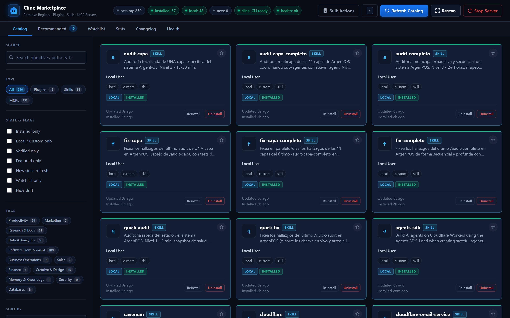
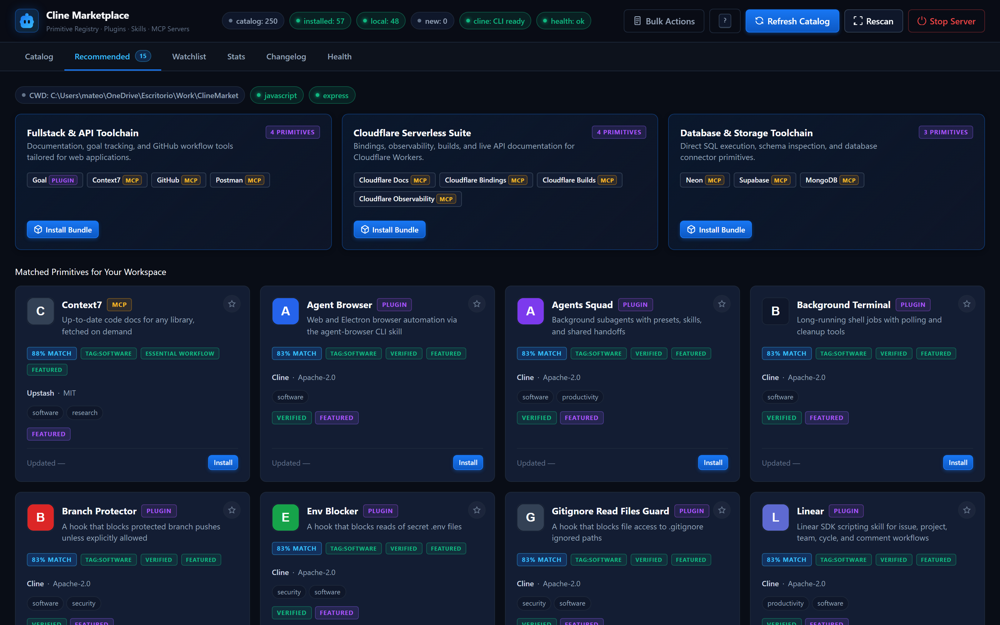
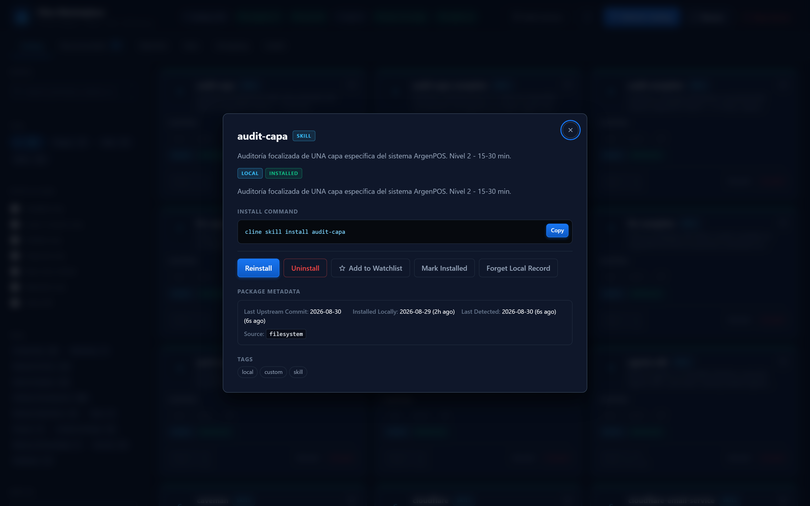
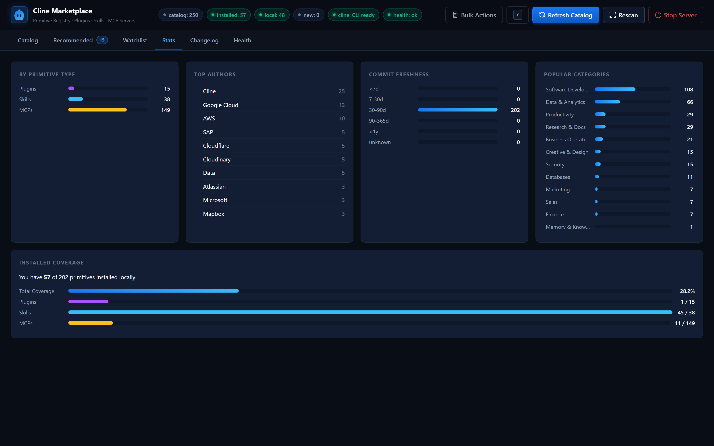
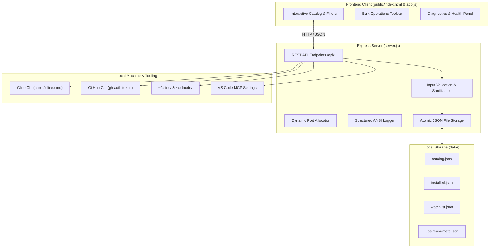

<div align="center">


# Cline Marketplace — Local Browser & Control Plane

A developer-grade, offline-first local web application and CLI to browse, install, verify, and manage every primitive (**plugins**, **skills**, and **MCP servers**) published in the official [Cline Marketplace](https://github.com/cline/marketplace).

[](https://nodejs.org)
[](https://expressjs.com)
[](https://developer.mozilla.org/en-US/docs/Web/JavaScript)
[](https://docs.cline.bot)
[](https://cli.github.com)
[](LICENSE)
[](#security-and-guard-rails)

</div>

---

## Table of Contents

- [Overview](#overview)
- [Visual Interface and Screenshots](#visual-interface-and-screenshots)
- [System Architecture](#system-architecture)
- [Core Features](#core-features)
- [Quick Start](#quick-start)
- [Command Line Interface](#command-line-interface)
- [REST API Reference](#rest-api-reference)
- [Workspace Context and Heuristics](#workspace-context-and-heuristics)
- [Security and Guard Rails](#security-and-guard-rails)
- [Configuration Reference](#configuration-reference)
- [Troubleshooting Matrix](#troubleshooting-matrix)
- [Contributing and Development](#contributing-and-development)
- [License](#license)

---

## Overview

The official [Cline Marketplace](https://cline.github.io/marketplace) provides a global registry of extensions, operating as a static JSON catalog. 

**Cline Marketplace Local Browser** transforms that catalog into a **bidirectional, local control plane**:

1. **Mirroring and Local Cache**: Ingests and persists the upstream catalog in `catalog.json` alongside upstream commit metadata in `data/upstream-meta.json`.
2. **Filesystem Discovery**: Scans local directories (`~/.cline/plugins/`, `~/.cline/skills/`) and VS Code configuration files (`cline_mcp_settings.json`, Claude Desktop configurations) to detect installed primitives.
3. **Automated CLI Bridge**: Dispatches `cline plugin install`, `cline skill install`, and `cline mcp install` directly from interactive cards, with automatic `--force` retry handling when upgrading existing installations.
4. **Offline First**: All search indexing, tag filtering, installed reconciliations, and watchlist management execute locally on your machine with zero external network dependencies beyond catalog refreshes.

---

## Visual Interface and Screenshots

### Catalog Browser View

Full catalog interface showing 200+ primitives, multi-token search, type chips, state flags, and real-time status strip.



### Recommended Workspace Toolchains

Auto-detects project tech stack, Git remotes, and dependency trees to rank primitives and curated toolchain bundles.



### Primitive Detail and Execution Modal

Deep view of any primitive showing official install commands, environment variable schemas, and action triggers.



### System Statistics and Diagnostics

Breakdown by primitive type, author metrics, commit freshness distribution, and local installation coverage.



---

## System Architecture



---

## Core Features

| Area | Functionality |
| :--- | :--- |
| **Catalog Browser** | Real-time search across 200+ primitives with multi-token filtering by keyword, author, license, tags, and state flags. |
| **Bulk Mode** | Multi-select primitives across search results to batch-install, batch-uninstall, or add to your watchlist in a single operation. |
| **Curated Toolchains** | Workspace toolchains (*Fullstack & API Toolchain*, *Cloudflare Serverless Suite*, *Database & Storage Toolchain*) installable with one click. |
| **Workspace Matcher** | Deep heuristic analysis of `package.json`, `pyproject.toml`, `Cargo.toml`, `go.mod`, Git remotes, and project files to score catalog entries. |
| **Drift Detection** | Surfaces a `drift` badge when a primitive is recorded in local history but physically absent from the filesystem. |
| **Dynamic Port Binding** | Automatically detects port conflicts on `5173` and binds to the next available socket (`5174`, `5175`, ...) without crashing. |
| **Process Management** | Dedicated server shutdown endpoint (`POST /api/shutdown`) allowing clean process termination from the web interface. |
| **Structured Terminal Logging** | Timestamped console logs with latency measurements, HTTP status indicators, and execution traces. |
| **Data Portability** | JSON export and import of installed primitive states with schema validation and overwrite protections. |

---

## Quick Start

### Running Locally from Source

```bash
# Clone the repository
git clone https://github.com/Mateo-Piedra22/ClineMarket.git
cd ClineMarket

# Install dependencies (Express 4.x)
npm install

# Download the latest catalog and commit metadata
npm run refresh

# Start the server (binds to http://127.0.0.1:5173 or next free port)
npm start
```

### Global CLI Installation

```bash
# Link globally to your system PATH
npm link

# Launch the marketplace from any workspace directory
cline-marketplace
```

Navigate to `http://127.0.0.1:5173` in your web browser.

---

## Command Line Interface

The `cline-marketplace` executable provides direct control over the service:

```bash
# Start server and automatically launch the default browser
cline-marketplace

# Start server in headless mode without opening a browser window
cline-marketplace --no-open

# Specify custom port override
cline-marketplace --port 5200

# Full catalog synchronization with GitHub commit timestamps
cline-marketplace refresh

# Fast catalog synchronization (skips commit metadata pass)
cline-marketplace refresh --catalog

# Display command help
cline-marketplace help
```

---

## REST API Reference

The server exposes a REST API on `http://127.0.0.1:5173`:

| Method | Endpoint | Description | Parameters / Payload |
| :--- | :--- | :--- | :--- |
| `GET` | `/api/catalog` | Returns the enriched catalog with local state, commit dates, and local custom entries. | None |
| `GET` | `/api/installed` | Executes a filesystem probe across `~/.cline` and VS Code configs, returning reconciled state. | None |
| `GET` | `/api/status` | Returns runtime health, Node version, detected `cline` path, and storage roots. | None |
| `GET` | `/api/context` | Runs stack heuristics against a workspace directory and returns ranked recommendations. | `?cwd=/path/to/project` |
| `POST` | `/api/install` | Invokes `cline <type> install <args>` with automatic `--force` retry on existing packages. | `{"type": "plugin", "id": "goal"}` |
| `POST` | `/api/uninstall` | Invokes `cline <type> uninstall <id>` and updates local registry records. | `{"type": "plugin", "id": "goal"}` |
| `POST` | `/api/bulk` | Executes batch installation, uninstallation, or watchlist assignment across up to 30 items. | `{"action": "install", "items": [{"type": "plugin", "id": "goal"}]}` |
| `GET` | `/api/watchlist` | Lists all starred primitives with timestamps. | None |
| `POST` | `/api/watchlist` | Adds a primitive to the local watchlist. | `{"type": "skill", "id": "code-review"}` |
| `DELETE` | `/api/watchlist/:type/:id` | Removes a primitive from the watchlist. | None |
| `POST` | `/api/mark` | Manually registers a primitive as installed without invoking the CLI. | `{"type": "plugin", "id": "my-custom-plugin"}` |
| `DELETE` | `/api/mark/:type/:id` | Removes a primitive from manual records. | None |
| `GET` | `/api/stats` | Aggregates category counts, top authors, freshness histograms, and coverage metrics. | None |
| `GET` | `/api/changelog` | Returns diff between current catalog and previous snapshot (`catalog-prev.json`). | None |
| `GET` | `/api/health` | Executes diagnostic probes (`node`, `cline`, `gh`, `storage`, `catalog`, `metadata`). | None |
| `GET` | `/api/export` | Generates a downloadable JSON backup of all installed primitives. | None |
| `POST` | `/api/import` | Restores installed primitives from a JSON backup with overwrite validation. | `{"installed": [...], "overwrite": false}` |
| `POST` | `/api/refresh` | Triggers background upstream catalog synchronization in-process. | `{"entriesOnly": false}` |
| `POST` | `/api/shutdown` | Gracefully terminates the background Node.js process. | None |

---

## Workspace Context and Heuristics

When navigating to the **Recommended** tab, `scripts/detect-context.mjs` analyzes the specified workspace directory and extracts stack metadata:

```jsonc
{
  "cwd": "C:/Projects/MyWebApp",
  "repo": { "owner": "Mateo-Piedra22", "name": "ClineMarket" },
  "languages": ["typescript", "javascript", "html", "css"],
  "frameworks": ["express", "nodejs"],
  "tags": ["software", "utilities", "databases"],
  "hints": ["Git repository detected", "Node.js project detected"]
}
```

Catalog primitives are evaluated against detected metadata using weighted affinity scoring:

$$\text{Affinity Score} = (6 \times \text{TagMatches}) + (8 \times \text{FrameworkMatches}) + (4 \times \text{LanguageMatches}) + \text{Bonuses}$$

- **Git Workflow Match**: $+7$ for Git and GitHub tooling when `.git` is detected.
- **Essential Multipliers**: $+5$ for core workflow tools (`goal`, `context7`).
- **Review Bonuses**: $+3$ for verified primitives, $+2$ for featured primitives.

---

## Security and Guard Rails

1. **Input Sanitization**:
   - Primitive `type` is constrained to `plugin`, `skill`, or `mcp`.
   - Primitive `id` is validated against `/^[a-zA-Z0-9@_.-]+$/`, rejecting path traversals (`..`), slashes, and control characters.
2. **Command Injection Prevention**:
   - Subprocesses are spawned with explicit argument arrays (`child_process.spawn(exe, args, { windowsHide: true })`), preventing shell interpolation.
3. **Atomic File Persistence**:
   - All state modifications (`installed.json`, `watchlist.json`, `context-cache.json`) write to temporary files before executing atomic renames, preventing corruption during abrupt shutdowns.
4. **HTTP Security Headers**:
   - `X-Content-Type-Options: nosniff`
   - `X-Frame-Options: SAMEORIGIN`
   - `Referrer-Policy: strict-origin-when-cross-origin`
   - `X-XSS-Protection: 1; mode=block`
   - `Permissions-Policy: camera=(), microphone=(), geolocation=()`
   - Default server binding is restricted to `127.0.0.1` (localhost).

---

## Configuration Reference

The following environment variables can be set:

| Variable | Default | Description |
| :--- | :--- | :--- |
| `PORT` | `5173` | Preferred HTTP port. If occupied, the next available port is chosen automatically. |
| `HOST` | `127.0.0.1` | Network interface to bind the server. |
| `CLINE_HOME` | `~/.cline` | Override directory for Cline storage and plugins. |
| `MARKETPLACE_CATALOG_URL` | `https://cline.github.io/marketplace/catalog.json` | Upstream registry endpoint. |
| `MARKETPLACE_REPO` | `cline/marketplace` | GitHub repository used for commit metadata queries. |
| `GITHUB_TOKEN` / `GH_TOKEN` | *(unset)* | GitHub Personal Access Token for high rate limits (auto-detected via `gh auth token`). |

---

## Troubleshooting Matrix

| Issue | Root Cause | Solution |
| :--- | :--- | :--- |
| `the 'cline' CLI is not on PATH` | Cline CLI is not installed globally | Run `npm install -g cline` or visit [docs.cline.bot](https://docs.cline.bot). |
| `Install finished with errors: Goal · exit 1` | Plugin is already installed on disk | The server automatically retries with `--force`. Ensure write permissions on `~/.cline`. |
| `Port 5173 in use` | Another service is listening on port 5173 | The server auto-switches to `5174+`. You can also specify `--port <number>`. |
| Cards display `Updated —` | Upstream commit metadata was skipped | Authenticate with `gh auth login` or set `GITHUB_TOKEN`, then run `npm run refresh`. |
| Active filter button not clearing | Search input was out of sync | Click the filter pill directly or click `Clear all` in the active filter bar. |

---

## Contributing and Development

```bash
# Run local development server with file watcher
npm run dev

# Run automated smoke test suite
node scripts/smoke-test.mjs

# Reset local data cache
rm -rf data/ && npm run refresh
```

---

## License

Distributed under the **Apache-2.0 License**. See [LICENSE](./LICENSE) for details.

*Note: Cline Marketplace Local Browser is an independent community tool and is not officially affiliated with Cline Bot Inc. The official registry repository is located at [github.com/cline/marketplace](https://github.com/cline/marketplace).*